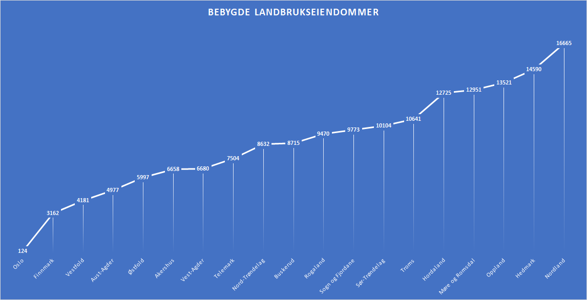
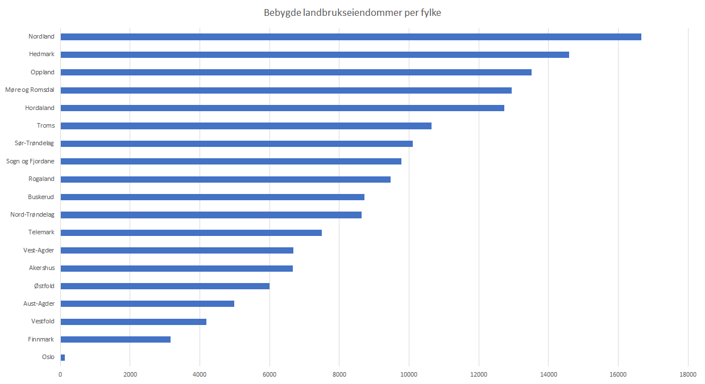
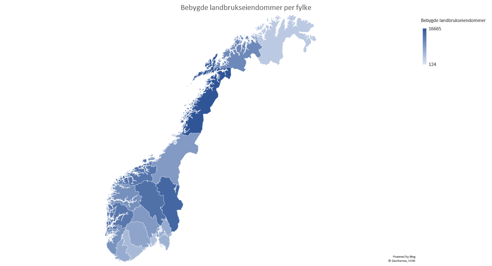

# Bebygde landbrukseiendommer per fylke

<table id="landbrukseiendommer">
    <thead>
        <tr>
            <th>Fylkenavn</th><th>Bebygde landbrukseiendommer</th>
        </tr>
    </thead>
    <tbody>
        <tr><td>Oslo</td><td>124</td></tr>
        <tr><td>Finnmark</td><td>3162</td></tr>
        <tr><td>Vestfold</td><td>4181</td></tr>
        <tr><td>Aust-Agder </td><td>4977</td></tr>
        <tr><td>Østfold</td><td>5997</td></tr>
        <tr><td>Akershus</td><td>6658</td></tr>
        <tr><td>Vest-Agder </td><td>6680</td></tr>
        <tr><td>Telemark</td><td>7504</td></tr>
        <tr><td>Nord-Trøndelag </td><td>8632</td></tr>
        <tr><td>Buskerud</td><td>8715</td></tr>
        <tr><td>Rogaland</td><td>9470</td></tr>
        <tr><td>Sogn og Fjordane</td><td>9773</td></tr>
        <tr><td>Sør-Trøndelag</td><td>10104</td></tr>
        <tr><td>Troms</td><td>10641</td></tr>
        <tr><td>Hordaland</td><td>12725</td></tr>
        <tr><td>Møre og Romsdal</td><td>12951</td></tr>
        <tr><td>Oppland</td><td>13521</td></tr>
        <tr><td>Hedmark</td><td>14590</td></tr>
        <tr><td>Nordland</td><td>16665</td></tr>
    </tbody>
</table>

## Antall landbrukseiendommer per fylke

## Kartlegging

<iframe title="Bebygde landbrukseiendommer" aria-label="Norway counties choropleth map" id="datawrapper-chart-qAaP7" src="//datawrapper.dwcdn.net/qAaP7/2/" scrolling="no" frameborder="0" style="width: 0; min-width: 100% !important;" height="400"></iframe>

