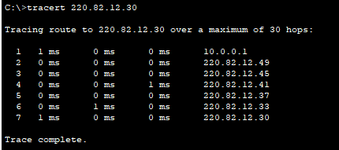
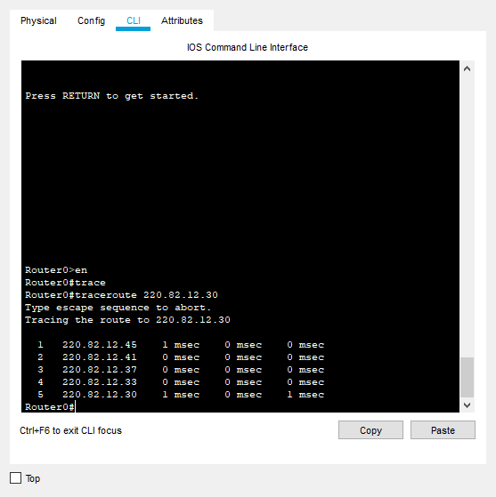

Arbeidskrav 2 (September 2019) - Nettverkskommunikasjon II - Alex Thomassen

# Innhold

- [Innhold](#innhold)
- [1. Planlegging av nettverk](#1-planlegging-av-nettverk)
    - [Offentlig nett](#offentlig-nett)
    - [Private nett bak NAT (Salg/Forskning)](#private-nett-bak-nat-salgforskning)
    - [Enhetsnavn, interfacenavn og IP-adresse](#enhetsnavn-interfacenavn-og-ip-adresse)
    - [DHCP](#dhcp)
- [2. NAT](#2-nat)
- [3. DHCP](#3-dhcp)
- [5. Hvor lang avstand mener EIGRP det er fra router 5 til public-server nettet?](#5-hvor-lang-avstand-mener-eigrp-det-er-fra-router-5-til-public-server-nettet)
- [6. Hva er oppgaven til STP i det switchede nettverket til venstre](#6-hva-er-oppgaven-til-stp-i-det-switchede-nettverket-til-venstre)
- [7. Hvilken sikkerhet gir NAT-oppsettet på router 5?](#7-hvilken-sikkerhet-gir-nat-oppsettet-p%c3%a5-router-5)
- [8. Hva slags fordeler gir VLAN-oppsettet her oss?](#8-hva-slags-fordeler-gir-vlan-oppsettet-her-oss)
- [9. Hvilken vei tar en pakke fra VLAN salg til Public nett servere? Hvordan kan du verifisere dette fra klienten?](#9-hvilken-vei-tar-en-pakke-fra-vlan-salg-til-public-nett-servere-hvordan-kan-du-verifisere-dette-fra-klienten)
- [10. Beskriv hvordan du verifiserer det samme fra router 0.](#10-beskriv-hvordan-du-verifiserer-det-samme-fra-router-0)
- [11. På hvilket lag i OSI-modellen finner vi IP-adressering?](#11-p%c3%a5-hvilket-lag-i-osi-modellen-finner-vi-ip-adressering)
- [12. Forklar prinsippet med Encapsulation i forbindelse med nettverkskommunikasjon.](#12-forklar-prinsippet-med-encapsulation-i-forbindelse-med-nettverkskommunikasjon)
- [13. Enheter fra VLAN salg skal kunne pinge servere i Public nett. De andre routerene skal ikke kunne gjøre dette. Hvordan vil du løse det? Gjør og forklar.](#13-enheter-fra-vlan-salg-skal-kunne-pinge-servere-i-public-nett-de-andre-routerene-skal-ikke-kunne-gj%c3%b8re-dette-hvordan-vil-du-l%c3%b8se-det-gj%c3%b8r-og-forklar)
- [14. Enheter i VLAN forskning skal kunne kjøre http og FTP mot server i VLAN salg, men ikke omvendt.](#14-enheter-i-vlan-forskning-skal-kunne-kj%c3%b8re-http-og-ftp-mot-server-i-vlan-salg-men-ikke-omvendt)

# 1. Planlegging av nettverk

For å kunne sette opp serial-link mellom Router0 og Router1 (begge er 2811), må det legges til et ekstra nettverkskort på begge routerne som heter `NM-4A/S`.

### Offentlig nett

|    Nettverksnavn     |   Nett-ID    |  Broadcast   |    Nettmaske    | CIDR | Antall hosts | Første adresse | Siste adresse |           Notat            |
| :------------------: | :----------: | :----------: | :-------------: | :--: | :----------: | :------------: | :-----------: | :------------------------: |
| Offentlig Servernett | 220.82.12.0  | 220.82.12.31 | 255.255.255.224 |  27  |      30      |  220.82.12.1   | 220.82.12.30  | Server-nett med 28 enheter |
|   Offentlig R4-R1    | 220.82.12.32 | 220.82.12.35 | 255.255.255.252 |  30  |      2       |  220.82.12.33  | 220.82.12.34  |      Router4-Router1       |
|   Offentlig R1-R3    | 220.82.12.36 | 220.82.12.39 | 255.255.255.252 |  30  |      2       |  220.82.12.37  | 220.82.12.38  |      Router1-Router3       |
|   Offentlig R3-R2    | 220.82.12.40 | 220.82.12.43 | 255.255.255.252 |  30  |      2       |  220.82.12.41  | 220.82.12.42  |      Router3-Router2       |
|   Offentlig R2-R0    | 220.82.12.44 | 220.82.12.47 | 255.255.255.252 |  30  |      2       |  220.82.12.45  | 220.82.12.46  |      Router2-Router0       |
|   Offentlig R0-R5    | 220.82.12.48 | 220.82.12.51 | 255.255.255.252 |  30  |      2       |  220.82.12.49  | 220.82.12.50  |      Router0-Router5       |
|   Offentlig R0-R1    | 220.82.12.52 | 220.82.12.55 | 255.255.255.252 |  30  |      2       |  220.82.12.53  | 220.82.12.54  |      Router0-Router1       |

### Private nett bak NAT (Salg/Forskning)

|  Nettverksnavn   |  Nett-ID   | Broadcast  |    Nettmaske    | CIDR | Antall hosts | Første adresse | Siste adresse |       Notat       |
| :--------------: | :--------: | :--------: | :-------------: | :--: | :----------: | :------------: | :-----------: | :---------------: |
|   Privat Salg    |  10.0.0.0  | 10.0.0.127 | 255.255.255.128 |  25  |     126      |    10.0.0.1    |  10.0.0.126   |   VLAN Salg 80    |
| Privat Forskning | 10.0.0.128 | 10.0.0.255 | 255.255.255.128 |  25  |     126      |   10.0.0.129   |  10.0.0.254   | VLAN Forskning 90 |

### Enhetsnavn, interfacenavn og IP-adresse

| Enhets- og interfacenavn |  IP-adresse  |    Nettmaske    |
| :----------------------: | :----------: | :-------------: |
|      Router4 FA0/1       | 220.82.12.1  | 255.255.255.224 |
|           FTP            | 220.82.12.10 | 255.255.255.224 |
|           WEB            | 220.82.12.20 | 255.255.255.224 |
|           DNS            | 220.82.12.30 | 255.255.255.224 |
|      Router4 FA0/0       | 220.82.12.33 | 255.255.255.252 |
|      Router1 FA0/1       | 220.82.12.34 | 255.255.255.252 |
|      Router1 FA0/0       | 220.82.12.37 | 255.255.255.252 |
|      Router3 FA0/1       | 220.82.12.38 | 255.255.255.252 |
|      Router3 FA0/0       | 220.82.12.41 | 255.255.255.252 |
|      Router2 FA0/1       | 220.82.12.42 | 255.255.255.252 |
|      Router2 FA0/0       | 220.82.12.45 | 255.255.255.252 |
|      Router0 FA0/0       | 220.82.12.46 | 255.255.255.252 |
|      Router0 FA0/1       | 220.82.12.49 | 255.255.255.252 |
|      Router5 FA0/0       | 220.82.12.50 | 255.255.255.252 |
|      Router0 SE1/0       | 220.82.12.53 | 255.255.255.252 |
|      Router1 SE1/0       | 220.82.12.54 | 255.255.255.252 |
| Router5 FA0/1.80 (Salg)  |   10.0.0.1   | 255.255.255.128 |
| Router5 FA0/1.90 (Forskning)  |  10.0.0.129  | 255.255.255.128 |
|   Server0 (Forskning)    |  10.0.0.135  | 255.255.255.128 |
|      Server1 (Salg)      |   10.0.0.5   | 255.255.255.128 |

### DHCP

|   Nettverk    | Excluded range | DHCP Fra adresse | DHCP Til adresse |
| :-----------: | :------------: | :--------------: | :--------------: |
|  10.0.0.0/25  |   10.0.0.1-9   |    10.0.0.10     |    10.0.0.126    |
| 10.0.0.128/25 | 10.0.0.129-139 |    10.0.0.140    |    10.0.0.254    |

# 2. NAT

Router5 er satt opp med NAT overload med `220.82.12.50` på utsiden av nettet.
Access list er satt opp slik at bare salgsnettet har tilgang til å nå ut til public nett.

# 3. DHCP

Router5 har 2 forskjellige DHCP pools som er til salgsnettet og forskningsnettet.

Salgsnettet har `10.0.0.0/25` med reserverte adresser: `10.0.0.1-9` med `.1` som routeren.
Forskningsnettet har `10.0.0.128/25` med reserverte adresser: `10.0.0.129-139` med `.129` som routeren.

I tillegg har jeg tildelt DNS-serveren i fra public servernett som default DNS server i salgsnettet (`220.82.12.30`). Dette er da ikke gjort med forskningsnettet, siden forskningsnettet ikke når ut til public nett.

# 5. Hvor lang avstand mener EIGRP det er fra router 5 til public-server nettet?

I følge `show ip route` er "distance" `40960` til det offentlig servernettet.

# 6. Hva er oppgaven til STP i det switchede nettverket til venstre

STP eller Spanning Tree Protocol er brukt hos switchene for å forhindre at frames går i en evig "loop" (blir sendt til enhver switch for evig).  
Ved hjelp av STP kan vi også ha backup links mellom switcher, i tilfelle en link mellom switcher blir brutt.

# 7. Hvilken sikkerhet gir NAT-oppsettet på router 5?

Først og fremst trenger ikke det offentlig nettverket å vite om de interne IP-adressene innenfor nettverket, men det er også slik at bare VLAN `Salg` har tilgang til NAT og ikke enheter i forskningsnettet. Med andre ord, enheter i forskningsnettet har ikke tilgang til internett i det hele tatt.
Sikkerheten ved det er at ingen fra utsiden (offentlige nettverket) har direkte tilgang til noen av enhetene på innsiden og eventuelle åpne porter for applikasjoner (f.eks. et web panel som går over HTTP) er ikke tilgjengelig med mindre det forwardes av routeren.

# 8. Hva slags fordeler gir VLAN-oppsettet her oss?

Vi deler opp avdelingene i forskjellige nettverk og det tillater oss å definere access-list, slik at salgsavdelingen ikke har tilgang til absolutt hele forskningsnettet.
Samtidig gir det også mulighet for oss å forhindre at forskningsnettet går ut mot internett.

# 9. Hvilken vei tar en pakke fra VLAN salg til Public nett servere? Hvordan kan du verifisere dette fra klienten?

Veien fra PC0 (Salg) til offentlig servernett er som følger:  
> Router5 -> Router0 -> Router2 -> Router3 -> Router1 -> Router4 -> Offentlig servernett

Dette kan vi verifisere fra en enhet i `Salg` ved hjelp av traceroute. På PC0 er dette: `tracert 220.82.12.30`  
IPen `220.82.12.30` er DNS-serveren i det offentlige servernettet.

# 10. Beskriv hvordan du verifiserer det samme fra router 0.

Det er nesten helt samme metode på router 0, vi kan bruke traceroute derfra også, men der er kommandoen `traceroute 220.82.12.30`.
Alternativt kan vi også bruke `show ip route` for å vise hvordan routingtabellen ser ut.

# 11. På hvilket lag i OSI-modellen finner vi IP-adressering?

IP-adressering (IPv4/IPv6) ligger på lag 3 i OSI-modellen. På lag 3 blir det sendt pakker bygd opp på følgende måte:

|                                   |                              |                     |      |
| :-------------------------------: | :--------------------------: | :------------------ | :--: |
| **IP Destination (Mål/Mottaker)** | **IP Source (Kilde/Sender)** | Protokoll (TCP/UDP) | Data |
| | I et NAT-nettverk vil source oversettes fra internt til eksternt nettverk. | | |

Det er også på lag 3 hvor vi har protokollen ICMP, som brukes til traceroute/ping.

# 12. Forklar prinsippet med Encapsulation i forbindelse med nettverkskommunikasjon.

Encapsulation er at man "pakker inn" data ekstra informasjon for å sende det videre til de andre lagene i OSI-modellen.

F.eks. vil TCP/UDP (lag 4) data videresendes til lag 3 hvor man legger til IP-informasjon (source/destination) før det sendes videre til lag 2.

# 13. Enheter fra VLAN salg skal kunne pinge servere i Public nett. De andre routerene skal ikke kunne gjøre dette. Hvordan vil du løse det? Gjør og forklar.

Jeg brukte ACL (access lists) for å tillate spesifikk trafikk inn på offentlig servernett.
Trafikken jeg bestemte meg for å tillate er: FTP, Web (HTTP), DNS og ICMP (ping/traceroute).

Access list er satt til følgende:

- Tillat FTP fra alle
- Tillat WWW (HTTP) fra alle
- Tillat DNS fra alle
- Tillat ICMP fra 220.82.12.50 (Router5/NAT).

I tillegg gikk jeg inn på interface `fa0/1` som "peker mot" det offentlige servernettet og satte access-list 110 til "out", siden trafikken går ut mot det offentlige servernett: `ip access-group 110 out`

Nederst i access list er det en "implicit deny" for alt annet trafikk. Det vil si at alt annet enn det som er definert i access list blir droppet.
I dette tilfellet vil all trafikk som ikke er FTP, HTTP, DNS eller ICMP (fra Router5) bli nektet tilgang inn til offentlig servernett.

Eneste unntak er Router4, som allerede er på "innsiden" av det offentlige servernettet. Router4 har også mulighet til å pinge inn til det offentlige servernettet, men jeg så ingen grunn til å spesifikt blokkere for Router4.

# 14. Enheter i VLAN forskning skal kunne kjøre http og FTP mot server i VLAN salg, men ikke omvendt.

Jeg satte følgende ACL-regler som utgående trafikk mot VLAN 90 (subinterface fa0/1.90):

- Blokker FTP fra 10.0.0.0/25 til 10.0.0.128/25
- Blokker HTTP fra 10.0.0.0/25 til 10.0.0.128/25
- Tillat alt annet TCP (utenom HTTP/FTP) til 10.0.0.128/25
- (Implicit deny)

Dette vil da blokkere HTTP/FTP trafikk mot hele salgsnettet. Jeg kunne alternativt ha blokkert for den ene serveren som står i salgsnettet (ved å spesifisere `host 10.0.0.5` i stedet for nettverket), men det ga mer mening å blokkere all slik trafikk inn til salg i tilfelle det kom nye servere med "sensitiv" informasjon.