# Hvordan hente ut data fra MySQL i C# program via Visual Studio.

## Før du starter
Denne guiden forventer at du har følgende allerede installert og konfigurert:

- Visual Studio (Community Edition eller bedre)
    - Visual Studio kan lastes ned fra deres hjemmeside: [https://visualstudio.microsoft.com/](https://visualstudio.microsoft.com/)
- MySQL Workbench og MySQL server
    - Alt dette kan installeres via "MySQL installer": [MySQL Installer][MySQL Installer]
- En database i MySQL med en tabell som inneholder data (f.eks. personinformasjon, leverandørinformasjon eller bilmerker).
    - I dette eksempelet vil jeg bruke en database som inneholder informasjon om studenter.

Guiden vil som regel ha menyvalg og lignende i f.eks. Visual Studio på engelsk, så du må eventuelt oversette fortløpende eller følge skjermbilder nøye.

## Steg 1: Installering av `Connector/NET`

`Connector/NET` er et bibliotek brukt av C# slik at du kan koble til en MySQL database i programmet ditt.  
Dette er nødvendig slik at man får hentet ut data fra MySQL.

Standardmappen for installasjonen av dette biblioteket er `C:\Program Files (x86)\MySQL\Connector NET 8.0\Assemblies\v4.5.2`.  
Hvis denne mappen eksisterer fra før og det ligger en `MySql.Data.dll` fil der, har du allerede installert biblioteket og du kan hoppe over dette steget.

### Nedlastning av MySQL installer

Gå til nettsiden for MySQL installer ved å klikke denne linken: [MySQL Installer][MySQL Installer]  
Linken bør automatisk "bla deg" nedover på siden til en del av siden som heter "Generally Available (GA) Releases" som ser slik ut:


Det har ikke så mye å si hvilken av disse du velger å laste ned, men i dette eksempelet tar jeg det første valget (`mysql-installer-web-community-8.0.15.0.msi` - 16.4M).  
Du vil bli sendt til en ny side som heter "Begin Your Download" og som spør deg om å registrere en konto eller logge inn.  
Bla litt lenger ned til du finner en link som sier "No thanks, just start my download". Trykk på denne:  


### Start installasjon av `Connector/NET`

Når du starter denne installasjonsfilen, bør den se slik ut:  


Naviger deg gjennom `MySQL Connectors -> Connector/NET -> Connector/NET 8.0` og trykk på `Connector/NET 8.0.13` (eller lignende) for å markere dette valget.  
Deretter trykker du på den grønne pilen i midten slik at dette valget "flyttes" over til høyre side.  


Deretter kan du trykke på "Next" og du vil komme til et nytt vindu som bør se slik ut:  


Trykk "Execute" og den vil installere biblioteket `Connector/NET`. Når denne er ferdig kan du trykke "Next" og til slutt "Finish".

Du har nå installert `Connector/NET` for MySQL.

## Steg 2: Sette opp prosjektet i Visual Studio

### Lage et nytt prosjekt

Hvis du ikke har et eksisterende prosjekt i Visual Studio, kan du lage et nytt prosjekt.  
Her lager jeg et prosjekt som heter `MySQLDatabaseTilkobling`, men dette kan du velge selv.

Lag et nytt prosjekt i Visual Studio som er basert på `Visual C# -> Windows Forms App (.NET Framework)`.  
Navnet på dette prosjektet har ikke så mye å si, men i dette tilfellet brukte jeg "MySQLDatabaseTilkobling".


### Legg til `Connector/NET` som referanse i prosjektet

For at du skal kunne bruke biblioteket `Connector/NET` etter det har blitt installert, må du legge det til som en referanse i prosjektet ditt.  
Dette kan du gjøre ved å gå på høyre side av Visual Studio, høyre-klikke på "References" og deretter "Add reference":  


I det nye vinduet som kommer opp, trykk på "Browse" nederst og bla deg fram til der `Connector/NET` er installert. Standardlokalisering for dette er `C:\Program Files (x86)\MySQL\Connector NET 8.0\Assemblies\v4.5.2`.  
Når du har navigert deg fram til denne mappen, velg filen `MySql.Data.dll`:  


Trykk deretter på "OK" og `Connector/NET` for MySQL vil være tilgjengelig for bruk i programmet ditt.

### Lage en ny klasse for tilkobling til MySQL

For å gjøre koden litt ryddigere, lager vi en klasse som inneholder koden for å koble til MySQL og sende SQL for å hente ut data.

Trykk på `Shift+Alt+C` for å lage en ny klasse (`Class`). Dette vil jeg da kalle for `DatabaseConnection.cs`.  


Når du har laget denne klassen, bør den åpne i en ny fane i Visual Studio. Det første vi må gjøre er å gjøre C# klar over at vi skal bruke MySQL her.

Øverst i koden er det noen linjer som begynner på `using`. Du kan la de eksisterende linjene være, men mellom linjene som starter med `using` og linjen som starter med `namespace`, legg til en ny linje hvor det står `using MySql.Data.MySqlClient;`  
I mitt eksempel vil dette se slik ut:  


Videre skal vi legge inn kode for å autentisere mot MySQL serveren, åpne og lukke tilkoblingen til MySQL serveren.

Innenfor `class`en din, må du definere tre ting. Et `MySqlConnection` variabel som inneholder tilkoblingsinformasjonen din til MySQL-serveren (serveradresse, brukernavn, passord og databasenavnet) og to metoder (`void`) kalt `OpenConnection()` og `CloseConnection()`.  
Denne koden ser da slik ut:

```csharp
class DatabaseConnection
{
    // Database server, brukernavn, passord og databasenavn
    // `server=localhost` definerer hvilken server du skal koble til.
    // `user id=root` definerer brukeren som vi skal koble til serveren med. For enkelthetens skyld bruker jeg "root", men i et produksjonssystem bør dette være en egen bruker.
    // `password=root123` er passordet til brukeren vi bruker
    // `database=student2018` er databasenavnet
    MySqlConnection connectionString = new MySqlConnection("server=localhost;user id=root;password=root123;database=student2018");

    // Åpner tilkoblingen (og holder den oppe) til MySQL server
    public void OpenConnection()
    {
        connectionString.Open();
    }

    // "Lukker" (avslutter) tilkoblingen til MySQL server
    public void CloseConnection()
    {
        connectionString.Close();
    }
}
```

**Pass på at du ikke inkluderer en ekstra `class DatabaseConnection`.**  
Se bildet nedenfor for sammenligning:  


## Steg 3: Oppsett av brukergrensesnittet

### Endre vindustittel

Det første jeg gjør er å sette en ny vindustittel.  
Dette er helt valgfritt, men vinduet vil da få et litt bedre navn. Det spiller ingen rolle hva du setter dette til.  
Tittelen vil da vises oppe i venstre hjørne av vinduet du lager.  
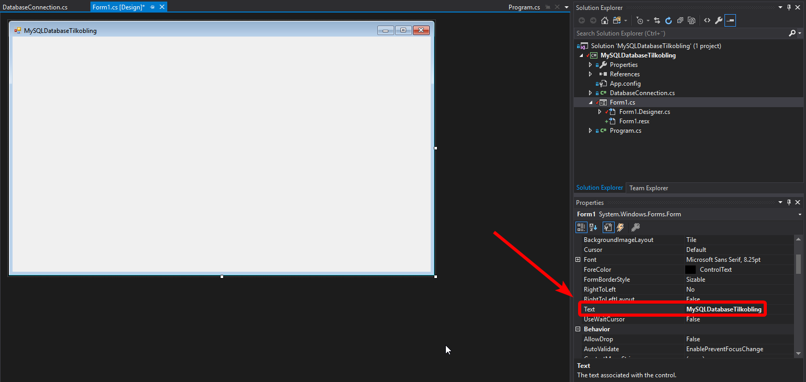

### Åpne toolbox

Øverst på venstre side av Visual Studio ligger det en knapp som heter "Toolbox".  
Jeg vil også råde deg å "Docke" denne. Altså slik at den holder seg åpen. Skjermbildet nedenfor viser deg hvor du finner dette valget.  
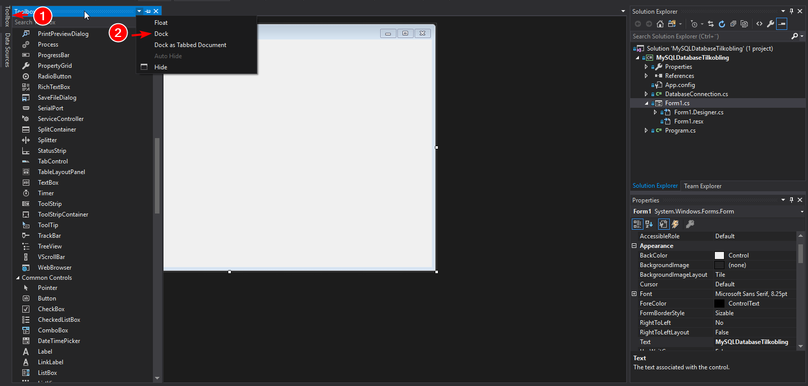

Denne toolboxen blir brukt for å dra vindu- eller designelementer til vinduet ditt. Dette kan da være en tekstboks, knapp eller lignende.

### Legge til `DataGridView` for å vise data fra MySQL

For at vi skal kunne vise data fra MySQL, må vi legge inn noe som heter `DataGridView` i fra Toolbox.  
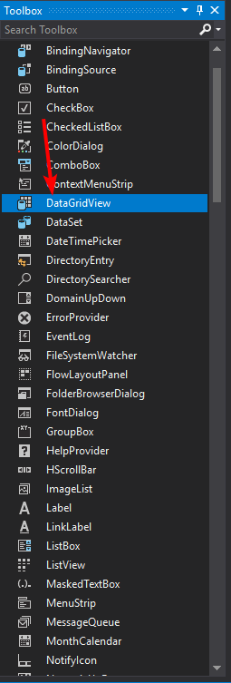

Trykk og dra denne til vinduet, jeg foreslår å justere den etter etter hjørnet på hovedvinduet.  
Det vil se slik ut:  
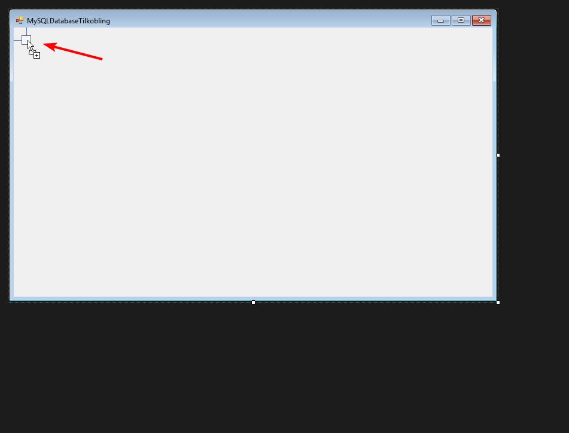

Når du har plassert `DataGridView`, bør det se slik ut:  
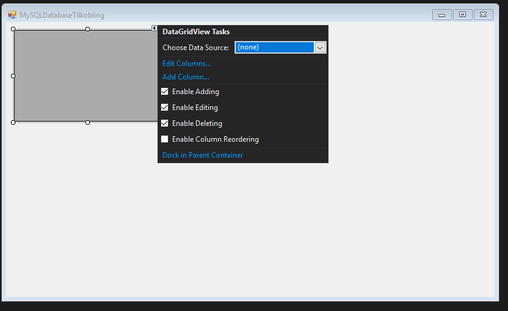

Du kan trykke på Escape (ESC) for å fjerne popup som heter "DataGridView Tasks".

Jeg foreslår også å dra punktet nederst til høyre for å fylle ut vinduet.  
Hvis du gjør dette, bør du la det være igjen litt vertikalt tomrom nederst for å ha plass til en knapp.

#### Navngi `DataGridView`

For å gjøre det enklere for oss når det gjelder referanser i koden vår, bør man navngi visse elementer. I dette tilfellet bør du trykke på DataGridView (det grå feltet) og deretter bla nedover i `Properties` nederst til høyre.  
Bla nedover til du finner `(Name)` under `Design`.  
Som standard vil dette hete noe lignende `dataGridView1`.  
Rediger dette feltet til noe annet som er litt mer logisk, jeg kommer til å bruke navnet `tableView`. Husk å trykke Enter etter å ha endret navnet.  
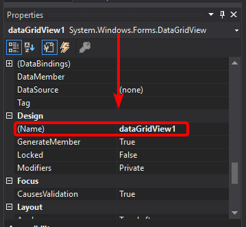

### Legge til `Button` for å oppdatere data i vinduet

Denne knappen vil være nyttig hvis du har oppdatert dataen i MySQL og trenger å oppdatere vinduet med den nye dataen.  
Knappen må også brukes ved oppstart av programmet for å hente data fra MySQL.

I Toolbox, finn "Button" nesten øverst og dra den på vinduet.  
Jeg foreslår å plassere den nederst på midten av vinduet:  
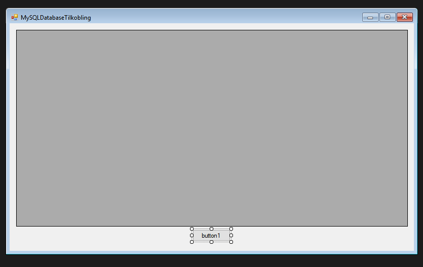

#### Navngi og oppdatering av tekst for knapp

Som med `DataGridView` bør vi endre navnet på knappen slik at referansen er lettere å bruke.  
I tillegg til dette, bør vi også endre teksten som vises på knappen i stedet for `button1`.

Dette gjør du ved å trykke/markere knappen og igjen gå til `Properties` nederst til høyre.  
Igjen så vil du bla til du finner `(Name)` under `Design`. Dette bør ha et navn som ligner på `button1`.  
I dette tilfellet kommer jeg til å bruke `refreshButton`. Pass på å trykke Enter etter at du har skrevet navnet for å sette det.  
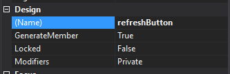

Mens du er i `Properties`, bla oppover til du finner `Text` under `Appearance`.  
Jeg endret dette til "Oppdater tabell", men det er valgfritt hva du skriver her.  
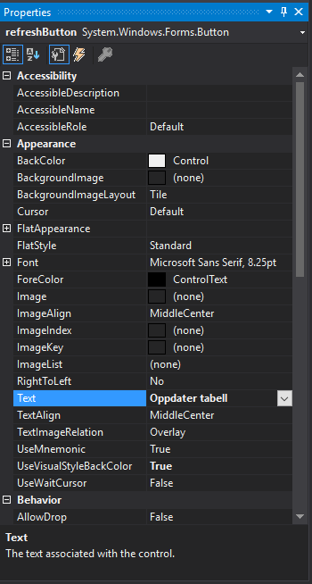

I tilegg bør du også justere knappen i vinduet (design), slik at teksten passer.  
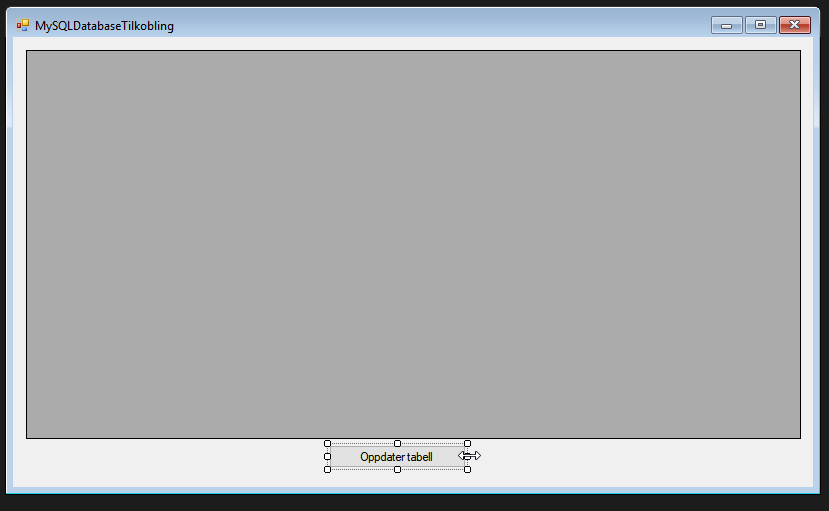

## Steg 4: Hente ut data og vise det i tabell.

Så langt har vi bare så vidt satt opp en klasse for å koble til MySQL og deretter designet programmet.  
For å hente ut data og legge det inn i programvinduet, må vi legge til litt kode til.

### DatabaseConnection.cs

Først dobbelttrykker du på `DatabaseConnection.cs` under `Solution explorer` for å åpne denne klassen:  
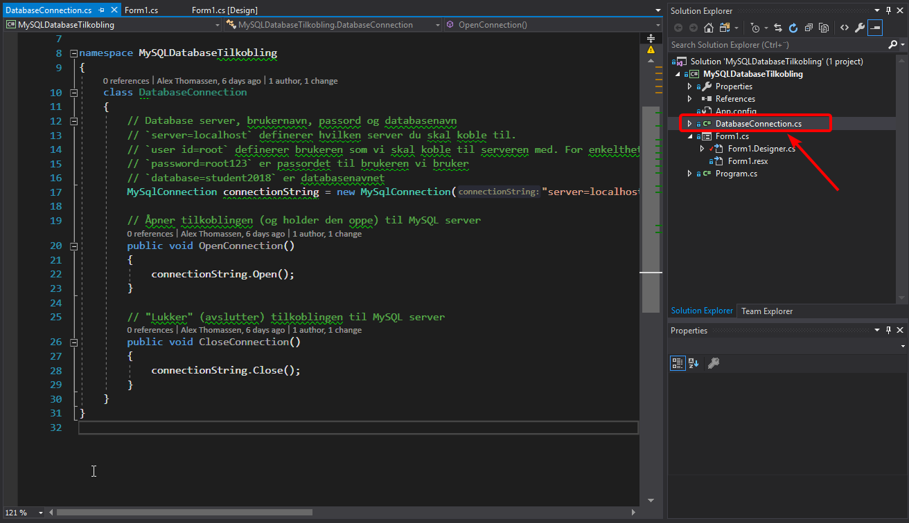

Øverst i denne filen, rett før `namespace ...` legg til dette:  

```csharp
using System.Data;
```

Om du er usikker på hvordan dette vil se ut, kan du bruke skjermbildet nedenfor som referanse:  
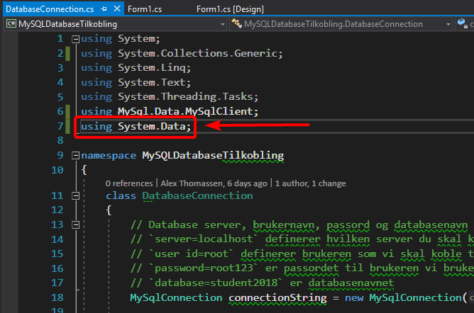

Etter den lille "blokken" som er relatert til `public void CloseConnection()`, legg til dette:

```csharp
public DataTable GetTableValues()
{
    // Lag et variabel som holder et midlertidig "DataTable"
    var table = new DataTable();

    // MySqlDataAdapter lar oss sende SQL-kode til serveren og hente ut
    // dataen vi vil ha fra databasen.
    // `student` er navnet på tabellen som bruker i MySQL. Dette bør oppdateres om du bruker noe annet.
    var data = new MySqlDataAdapter($"select * from student", connectionString);

    // Fyller opp det midlertidige "DataTable"-variabelet med data
    // fra MySQL-databasen som vi akkurat hentet ut.
    data.Fill(table);

    // Returnerer dataen som en "DataTable"-verdi
    // Dette er ment til å brukes i "DataGridView" i form'et.
    return table;
}
```

Nedenfor har jeg limt inn hele koden som jeg har i `DatabaseConnection.cs`-filen. Pass på å oppdatere visse detaljer som f.eks. brukernavn, passord, databasenavn og tabellnavn hvis du kopierer og limer direkte:

```csharp
using System;
using System.Collections.Generic;
using System.Linq;
using System.Text;
using System.Threading.Tasks;
using MySql.Data.MySqlClient;
using System.Data;

namespace MySQLDatabaseTilkobling
{
    class DatabaseConnection
    {
        // Database server, brukernavn, passord og databasenavn
        // `server=localhost` definerer hvilken server du skal koble til.
        // `user id=root` definerer brukeren som vi skal koble til serveren med. For enkelthetens skyld bruker jeg "root", men i et produksjonssystem bør dette være en egen bruker.
        // `password=root123` er passordet til brukeren vi bruker
        // `database=student2018` er databasenavnet
        MySqlConnection connectionString = new MySqlConnection("server=localhost;user id=root;password=root123;database=student2018");

        // Åpner tilkoblingen (og holder den oppe) til MySQL server
        public void OpenConnection()
        {
            connectionString.Open();
        }

        // "Lukker" (avslutter) tilkoblingen til MySQL server
        public void CloseConnection()
        {
            connectionString.Close();
        }

        public DataTable GetTableValues()
        {
            // Lag et variabel som holder et midlertidig "DataTable"
            var table = new DataTable();

            // MySqlDataAdapter lar oss sende SQL-kode til serveren og hente ut
            // dataen vi vil ha fra databasen.
            // `student` er navnet på tabellen som bruker i MySQL. Dette bør oppdateres om du bruker noe annet.
            var data = new MySqlDataAdapter($"select * from student", connectionString);

            // Fyller opp det midlertidige "DataTable"-variabelet med data
            // fra MySQL-databasen som vi akkurat hentet ut.
            data.Fill(table);

            // Returnerer dataen som en "DataTable"-verdi
            // Dette er ment til å brukes i "DataGridView" i form'et.
            return table;
        }
    }
}
```

### Form1.cs

For å vise dataen i programvinduet når du trykker på knappen, må du gå tilbake til fanen som heter `Form1.cs [Design]` eller alternativt dobbeltklikke på `Form1.cs` i `Solution explorer`.  
Når du har fått denne fanen åpen og programvinduet vises, dobbeltklikk på knappen slik at du får en ny fane som bare er kode.

Denne fanen åpnes automatisk innenfor en metode som i mitt tilfelle heter `refreshButton_click`.  
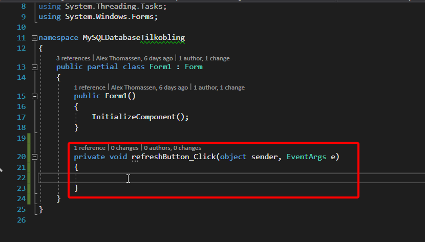

Innenfor her kan du skrive inn dette:  

```csharp
DatabaseConnection database = new DatabaseConnection();

// Åpne en tilkobling til MySQL
database.OpenConnection();

// Hent ut data og sett dette inn i programvindu
tableView.DataSource = database.GetTableValues();

// Lukk tilkoblingen til MySQL
database.CloseConnection();
```

Dette bør da se slik ut:  
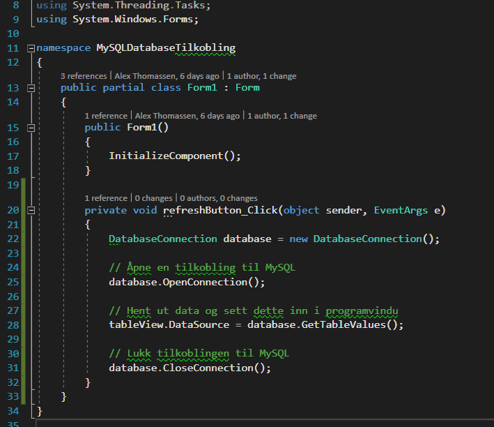

## Steg 5: Start programmet.

Du bør nå være ferdig med selve programmet. Det eneste du trenger å gjøre for å teste, er å trykke på "Start" på toppen av vinduet.

**Pass på at MySQL-serveren kjører.** Har du denne lokalt, starter du opp MySQL Workbench og sjekker om dette kjører via `Instance -> Startup / Shutdown`.

Når programmet kjører trenger du bare å trykke på knappen (`Oppdater tabell`) og programmet vil hente ut og vise dataen på skjermen din.  
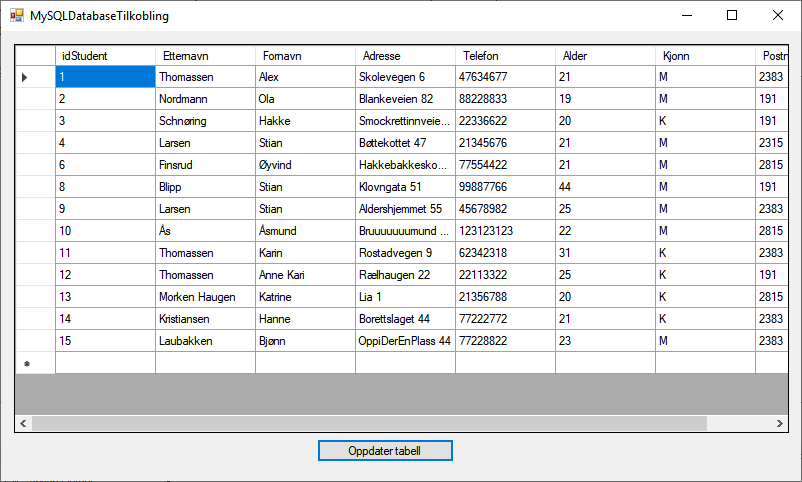

Skjer dette feilfritt er du ferdig! :)

[MySQL Installer]: https://dev.mysql.com/downloads/installer/#downloads