# Hvordan hente ut data fra MySQL i C# program via Visual Studio.

## Før du starter
Denne guiden forventer at du har følgende allerede installert og konfigurert:

- Visual Studio (Community Edition eller bedre)
    - Visual Studio kan lastes ned fra deres hjemmeside: [https://visualstudio.microsoft.com/](https://visualstudio.microsoft.com/)
- MySQL Workbench og MySQL server
    - Alt dette kan installeres via "MySQL installer": [MySQL Installer][MySQL Installer]
- En database i MySQL med en tabell som inneholder data (f.eks. personinformasjon, leverandørinformasjon eller bilmerker).
    - I dette eksempelet vil jeg bruke en database som inneholder informasjon om studenter.

Guiden vil som regel ha menyvalg og lignende i f.eks. Visual Studio på engelsk, så du må eventuelt oversette fortløpende eller følge skjermbilder nøye.

## Steg 1: Installering av `Connector/NET`
`Connector/NET` er et bibliotek brukt av C# slik at du kan koble til en MySQL database i programmet ditt.  
Dette er nødvendig slik at man får hentet ut data fra MySQL.

Standardmappen for installasjonen av dette biblioteket er `C:\Program Files (x86)\MySQL\Connector NET 8.0\Assemblies\v4.5.2`.  
Hvis denne mappen eksisterer fra før og det ligger en `MySql.Data.dll` fil der, har du allerede installert biblioteket og du kan hoppe over dette steget.

### Nedlastning av MySQL installer
Gå til nettsiden for MySQL installer ved å klikke denne linken: [MySQL Installer][MySQL Installer]  
Linken bør automatisk "bla deg" nedover på siden til en del av siden som heter "Generally Available (GA) Releases" som ser slik ut:
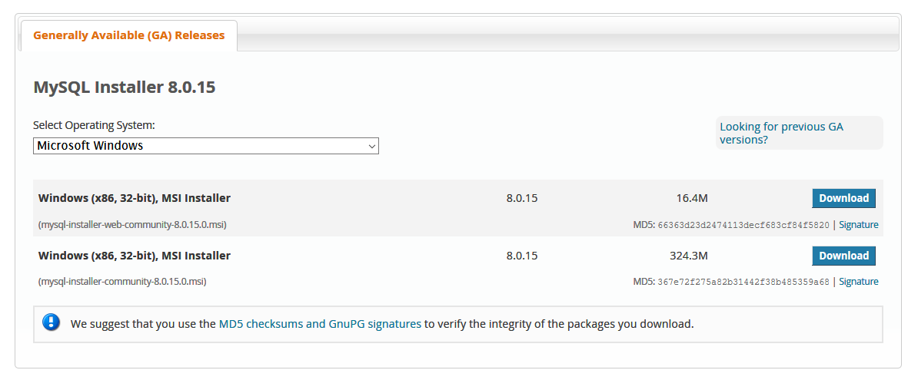

Det har ikke så mye å si hvilken av disse du velger å laste ned, men i dette eksempelet tar jeg det første valget (`mysql-installer-web-community-8.0.15.0.msi` - 16.4M).  
Du vil bli sendt til en ny side som heter "Begin Your Download" og som spør deg om å registrere en konto eller logge inn.  
Bla litt lenger ned til du finner en link som sier "No thanks, just start my download". Trykk på denne:  
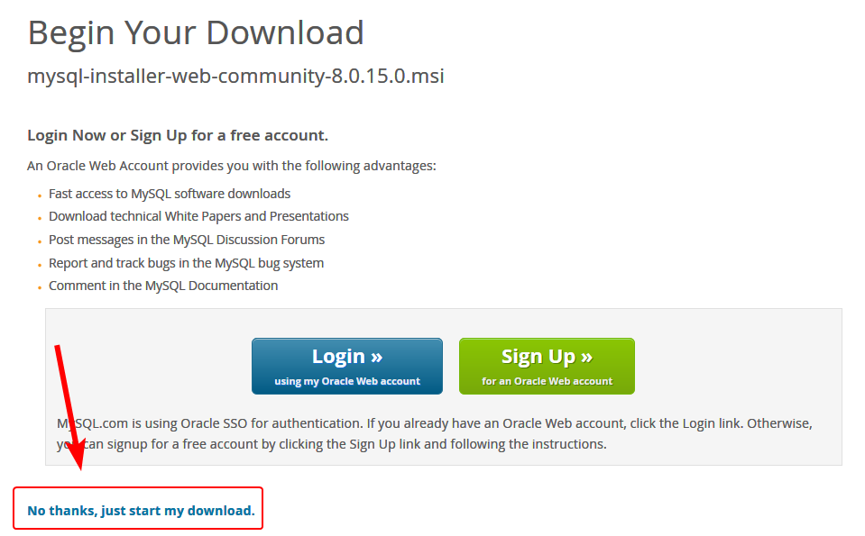

### Start installasjon av `Connector/NET`

Når du starter denne installasjonsfilen, bør den se slik ut:  
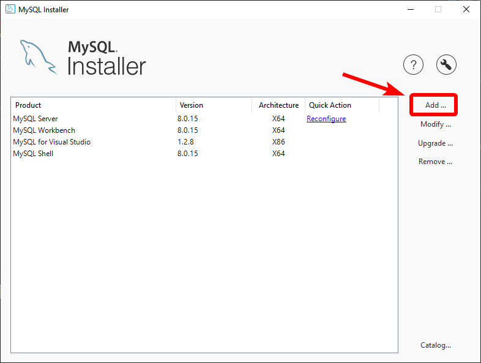

Naviger deg gjennom `MySQL Connectors -> Connector/NET -> Connector/NET 8.0` og trykk på `Connector/NET 8.0.13` (eller lignende) for å markere dette valget.  
Deretter trykker du på den grønne pilen i midten slik at dette valget "flyttes" over til høyre side.  
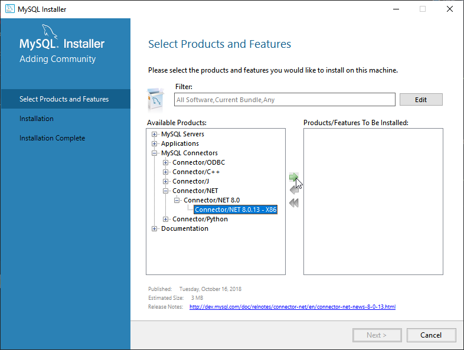

Deretter kan du trykke på "Next" og du vil komme til et nytt vindu som bør se slik ut:  
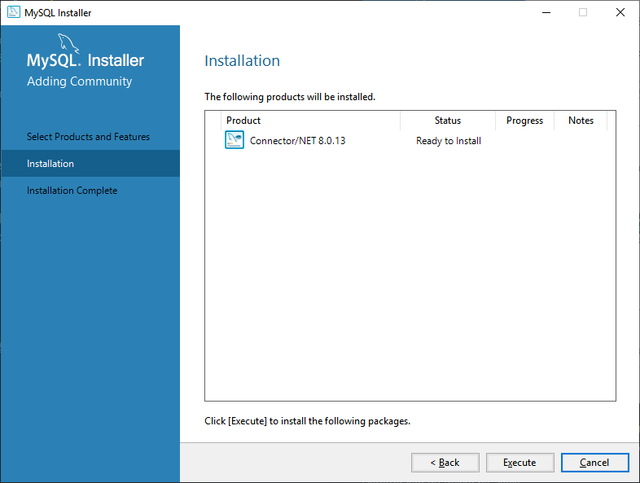

Trykk "Execute" og den vil installere biblioteket `Connector/NET`. Når denne er ferdig kan du trykke "Next" og til slutt "Finish".

Du har nå installert `Connector/NET` for MySQL.

## Steg 2: Sette opp prosjektet i Visual Studio

### Lage et nytt prosjekt
Hvis du ikke har et eksisterende prosjekt i Visual Studio, kan du lage et nytt prosjekt.  
Her lager jeg et prosjekt som heter `MySQLDatabaseTilkobling`, men dette kan du velge selv.

Lag et nytt prosjekt i Visual Studio som er basert på `Visual C# -> Windows Forms App (.NET Framework)`.  
Navnet på dette prosjektet har ikke så mye å si, men i dette tilfellet brukte jeg "MySQLDatabaseTilkobling".

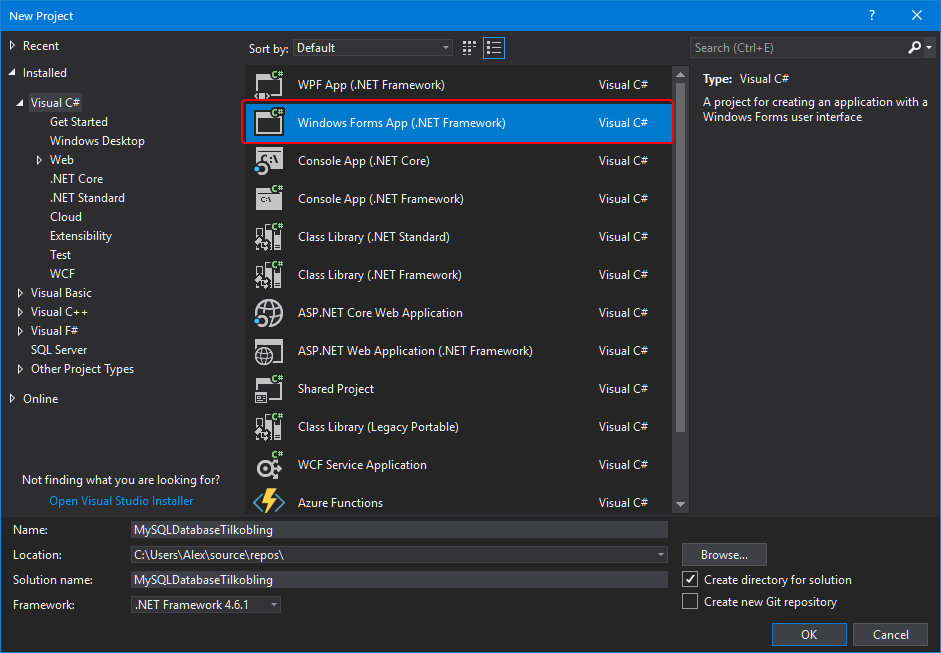

### Legg til `Connector/NET` som referanse i prosjektet
For at du skal kunne bruke biblioteket `Connector/NET` etter det har blitt installert, må du legge det til som en referanse i prosjektet ditt.  
Dette kan du gjøre ved å gå på høyre side av Visual Studio, høyre-klikke på "References" og deretter "Add reference":  
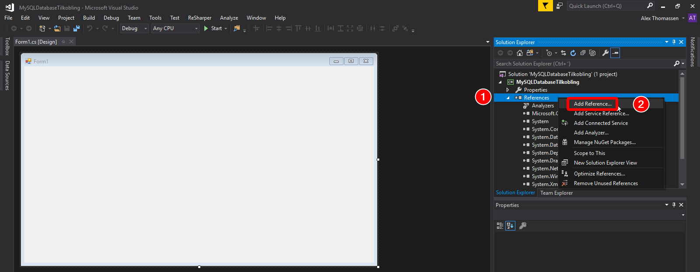

I det nye vinduet som kommer opp, trykk på "Browse" nederst og bla deg fram til der `Connector/NET` er installert. Standardlokalisering for dette er `C:\Program Files (x86)\MySQL\Connector NET 8.0\Assemblies\v4.5.2`.  
Når du har navigert deg fram til denne mappen, velg filen `MySql.Data.dll`:  
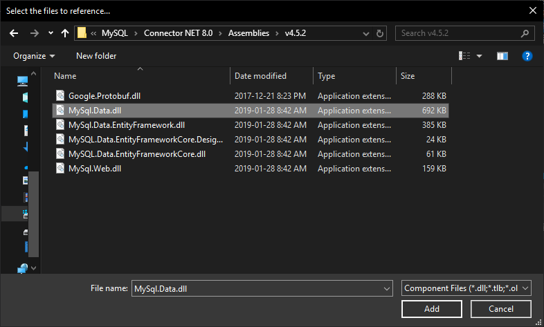

Trykk deretter på "OK" og `Connector/NET` for MySQL vil være tilgjengelig for bruk i programmet ditt.

### Lage en ny klasse for tilkobling til MySQL
For å gjøre koden litt ryddigere, lager vi en klasse som inneholder koden for å koble til MySQL og sende SQL for å hente ut data.

Trykk på `Shift+Alt+C` for å lage en ny klasse (`Class`). Dette vil jeg da kalle for `DatabaseConnection.cs`.  
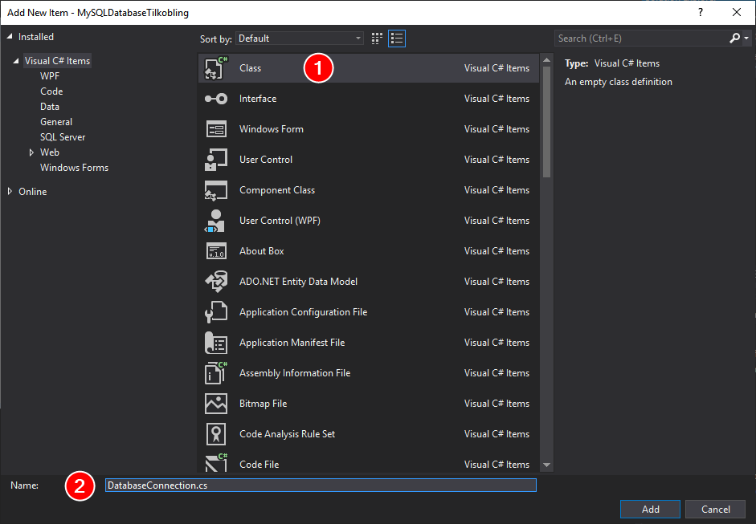

Når du har laget denne klassen, bør den åpne i en ny fane i Visual Studio. Det første vi må gjøre er å gjøre C# klar over at vi skal bruke MySQL her.

Øverst i koden er det noen linjer som begynner på `using`. Du kan la de eksisterende linjene være, men mellom linjene som starter med `using` og linjen som starter med `namespace`, legg til en ny linje hvor det står `using MySql.Data.MySqlClient;`  
I mitt eksempel vil dette se slik ut:  
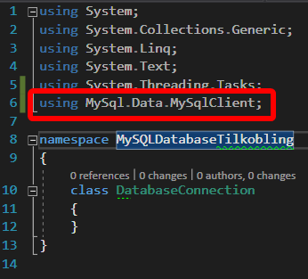

Videre skal vi legge inn kode for å autentisere mot MySQL serveren, åpne og lukke tilkoblingen til MySQL serveren.

Innenfor `class`en din, må du definere tre ting. Et `MySqlConnection` variabel som inneholder tilkoblingsinformasjonen din til MySQL-serveren (serveradresse, brukernavn, passord og databasenavnet) og to metoder (`void`) kalt `OpenConnection()` og `CloseConnection()`.  
Denne koden ser da slik ut:
```csharp
class DatabaseConnection
{
    // Database server, brukernavn, passord og databasenavn
    // `server=localhost` definerer hvilken server du skal koble til.
    // `user id=root` definerer brukeren som vi skal koble til serveren med. For enkelthetens skyld bruker jeg "root", men i et produksjonssystem bør dette være en egen bruker.
    // `password=root123` er passordet til brukeren vi bruker
    // `database=student2018` er databasenavnet
    MySqlConnection connectionString = new MySqlConnection("server=localhost;user id=root;password=root123;database=student2018");

    // Åpner tilkoblingen (og holder den oppe) til MySQL server
    public void OpenConnection()
    {
        connectionString.Open();
    }

    // "Lukker" (avslutter) tilkoblingen til MySQL server
    public void CloseConnection()
    {
        connectionString.Close();
    }
}
```

**Pass på at du ikke inkluderer en ekstra `class DatabaseConnection`.**  
Se bildet nedenfor for sammenligning:  
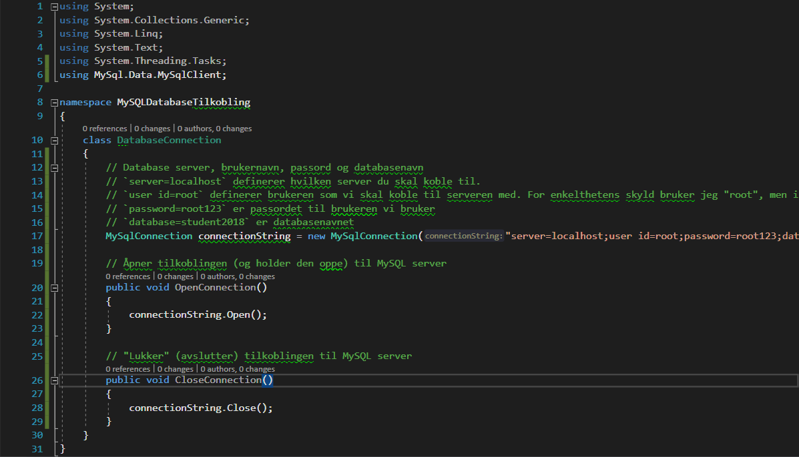

## Steg 3: Oppsett av brukergrensesnittet

[MySQL Installer]: https://dev.mysql.com/downloads/installer/#downloads