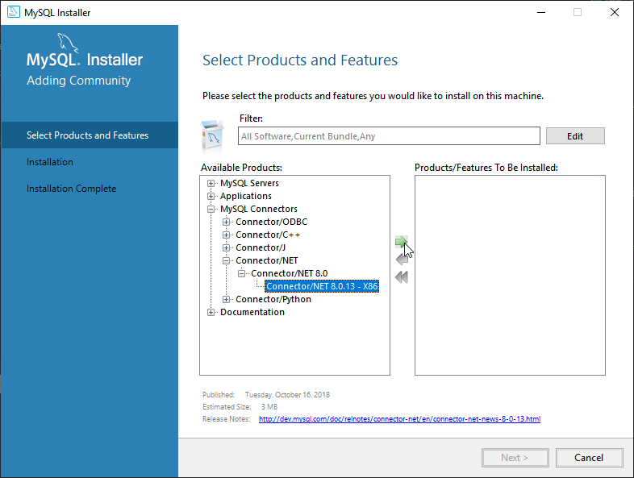
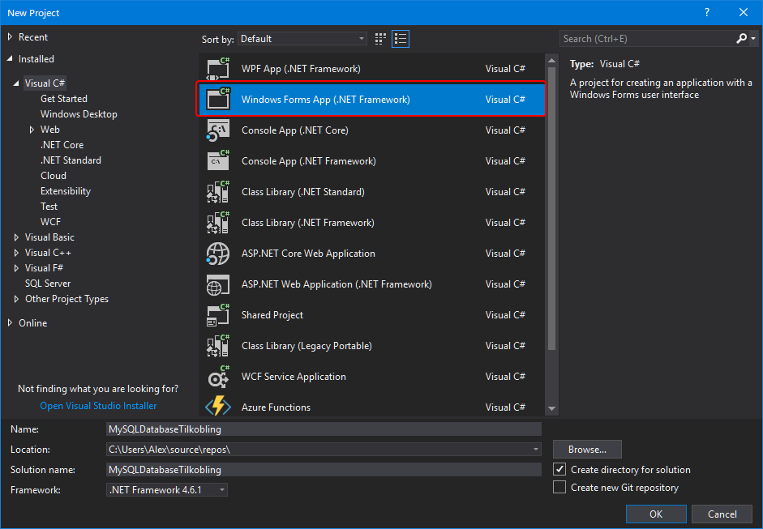

# Hvordan hente ut data fra MySQL i C# program via Visual Studio.

## Før du starter
Denne guiden forventer at du har følgende allerede installert og konfigurert:

- Visual Studio (Community Edition eller bedre)
    - Visual Studio kan lastes ned fra deres hjemmeside: [https://visualstudio.microsoft.com/](https://visualstudio.microsoft.com/)
- MySQL Workbench og MySQL server
    - Alt dette kan installeres via "MySQL installer": [MySQL Installer][MySQL Installer]
- En database i MySQL med en tabell som inneholder data (f.eks. personinformasjon, leverandørinformasjon eller bilmerker).
    - I dette eksempelet vil jeg bruke en database som inneholder informasjon om studenter.

Guiden vil som regel ha menyvalg og lignende i f.eks. Visual Studio på engelsk, så du må eventuelt oversette fortløpende eller følge skjermbilder nøye.

## Steg 1: Installering av `Connector/NET`
`Connector/NET` er et bibliotek brukt av C# slik at du kan koble til en MySQL database i programmet ditt.  
Dette er nødvendig slik at man får hentet ut data fra MySQL.

Standardmappen for installasjonen av dette biblioteket er `C:\Program Files (x86)\MySQL\Connector NET 8.0\Assemblies\v4.5.2`.  
Hvis denne mappen eksisterer fra før og det ligger en `MySql.Data.dll` fil der, har du allerede installert biblioteket og du kan hoppe over dette steget.

### Nedlastning av MySQL installer
Gå til nettsiden for MySQL installer ved å klikke denne linken: [MySQL Installer][MySQL Installer]  
Linken bør automatisk "bla deg" nedover på siden til en del av siden som heter "Generally Available (GA) Releases" som ser slik ut:

Det har ikke så mye å si hvilken av disse du velger å laste ned, men i dette eksempelet tar jeg det første valget (`mysql-installer-web-community-8.0.15.0.msi` - 16.4M).  
Du vil bli sendt til en ny side som heter "Begin Your Download" og som spør deg om å registrere en konto eller logge inn.  
Bla litt lenger ned til du finner en link som sier "No thanks, just start my download". Trykk på denne:

### Start installasjon av `Connector/NET`

Når du starter denne installasjonsfilen, bør den se slik ut:

Trykk på "Add" og vinduet bør se slik ut:

Naviger deg gjennom `MySQL Connectors -> Connector/NET -> Connector/NET 8.0` og trykk på `Connector/NET 8.0.13` (eller lignende) for å markere dette valget.  
Deretter trykker du på den grønne pilen i midten slik at dette valget "flyttes" over til høyre side.  
Deretter kan du trykke på "Next" og du vil komme til et nytt vindu som bør se slik ut:

Trykk "Execute" og den vil installere biblioteket `Connector/NET`. Når denne er ferdig kan du trykke "Next" og til slutt "Finish".

Du har nå installert `Connector/NET` for MySQL.

## Steg 2: Lage et prosjekt i Visual Studio
Lag et nytt prosjekt i Visual Studio som er basert på `Visual C# -> Windows Forms App (.NET Framework)`.  
Navnet på dette prosjektet har ikke så mye å si, men i dette tilfellet brukte jeg "MySQLDatabaseTilkobling".

## Steg 3:

[MySQL Installer]: https://dev.mysql.com/downloads/installer/#downloads